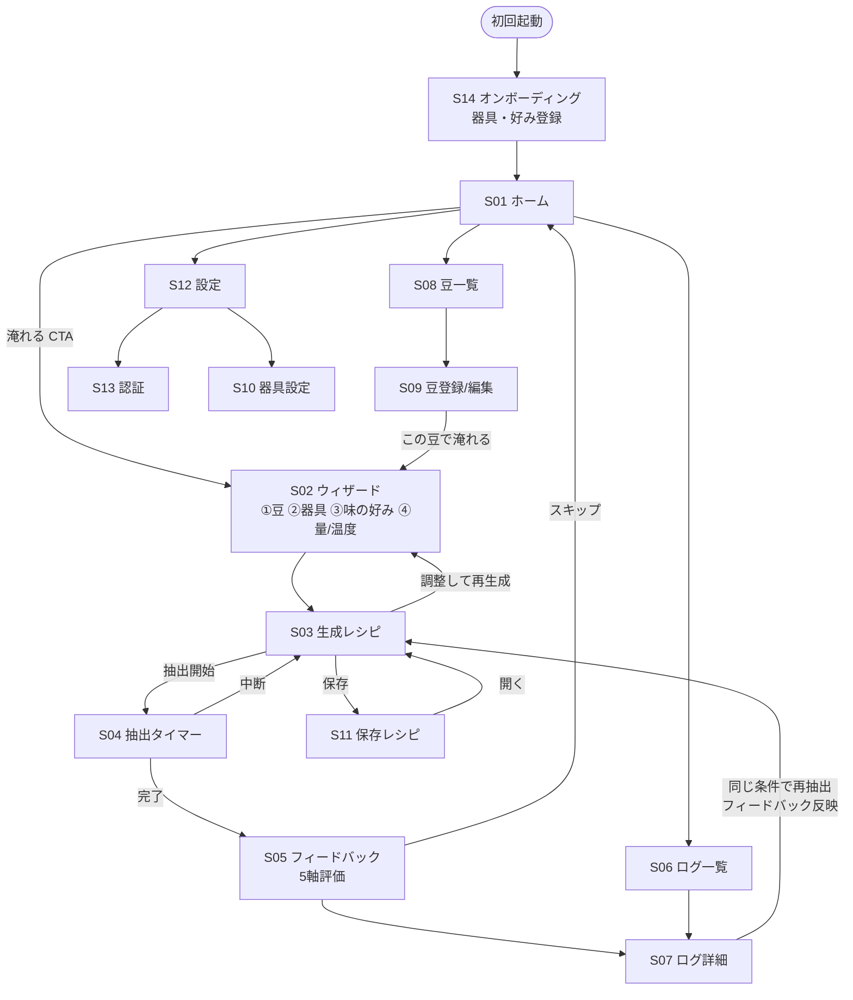

# 06. 画面一覧・画面遷移図・ワイヤーフレーム

## 1. 画面一覧

| ID | パス | 画面名 | 認証 | フェーズ |
|---|---|---|---|---|
| S01 | `/` | ホーム | 任意 | MVP |
| S02 | `/brew` | レシピ生成ウィザード（4ステップ） | 任意 | MVP |
| S03 | `/brew/result` | 生成レシピ表示 | 任意 | MVP |
| S04 | `/brew/timer` | ガイド付き抽出タイマー | 任意 | MVP |
| S05 | `/brew/feedback` | 抽出後フィードバック | 任意 | MVP(保存はβ) |
| S06 | `/log` | 抽出ログ一覧 | 任意* | MVP(ローカル) |
| S07 | `/log/[id]` | 抽出ログ詳細 | 任意* | MVP(ローカル) |
| S08 | `/beans` | 豆一覧 | 任意* | MVP(ローカル) |
| S09 | `/beans/new`, `/beans/[id]` | 豆登録・編集 | 任意* | MVP(ローカル) |
| S10 | `/gear` | 器具設定（ドリッパー・グラインダー） | 任意* | MVP |
| S11 | `/recipes` | 保存レシピ一覧 | 任意* | β |
| S12 | `/settings` | 設定（テーマ・単位・アカウント） | 任意 | MVP |
| S13 | `/auth/sign-in`, `/auth/sign-up` | 認証 | — | β |
| S14 | `/onboarding` | 初回オンボーディング（器具登録） | — | MVP |
| S15 | `/r/[shareId]` | 公開レシピ共有ページ | 不要 | v1.0 |

*「任意」= ゲストは localStorage、ログイン時は D1 同期（docs/09 §4）。

ナビゲーション（下部タブ）: **ホーム / 淹れる / ログ / 豆 / 設定**

## 2. 画面遷移図



**中核ループ**: S02 生成 → S04 抽出 → S05 評価 → （次回）S03 に反映。この4画面の体験品質に投資を集中する。

## 3. ワイヤーフレーム（主要画面）

### S01 ホーム
```
┌──────────────────────────┐
│ おはようございます ☀ 7:24    │ ← 時間帯挨拶(small)
│                          │
│ ┌──────────────────────┐ │
│ │  ☕ 今日の一杯を淹れる    │ │ ← 最重要CTA(primary/大)
│ │  前回: エチオピア/V60 ★4.5│ │
│ └──────────────────────┘ │
│ クイック再抽出               │
│ ┌────────┐ ┌────────┐    │ ← 直近レシピの横スクロールカード
│ │ｴﾁｵﾋﾟｱ  │ │ｹﾆｱ     │    │
│ │V60 92°C│ │Switch  │    │
│ └────────┘ └────────┘    │
│ 最近の抽出                  │
│ ・7/9 エチオピア ★★★★☆     │
│ ・7/8 ケニア     ★★★☆☆    │
├──────────────────────────┤
│ [ホーム][淹れる][ログ][豆][⚙] │ ← タブバー
└──────────────────────────┘
```

### S02 ウィザード（ステップ3: 味の好み）
```
┌──────────────────────────┐
│ ← 味の好み          3/4   │ ← 進行ドット
│                          │
│      ／レーダー＼           │ ← TasteRadar(リアルタイム反映)
│     〈 5軸チャート 〉        │
│      ＼＿＿＿＿／           │
│ 酸味     ●────○──   +1   │ ← -2..+2 スライダー×5
│ 甘さ     ──●─────   +2   │
│ 苦味     ──○──●──    0   │
│ ボディ   ─●──────   -1   │
│ クリア感  ──●─────   +1   │
│                          │
│ プリセット:                 │
│ [明るく華やか][バランス][コク深]│ ← チップで一括設定
│ ┌──────────────────────┐ │
│ │        次へ →          │ │
│ └──────────────────────┘ │
└──────────────────────────┘
```

### S03 生成レシピ
```
┌──────────────────────────┐
│ ← エチオピア × V60    [保存] │
│ ┌──────────────────────┐ │
│ │ 15.0g / 250g  1:16.7  │ │ ← 主要数値(大・tabular)
│ │ 92°C   中細挽き        │ │
│ │ Comandante: 24クリック  │ │ ← 一般表記+目盛併記
│ │ 総時間 ~2:45           │ │
│ └──────────────────────┘ │
│ 注湯スケジュール             │
│ ├0:00 蒸らし 45g          │ ← PourTimeline
│ ├0:45 1投目 →105g        │   (帯グラフ+リスト)
│ ├1:15 2投目 →175g        │
│ └1:45 3投目 →250g        │
│ ▼ なぜこのレシピ？           │ ← Rationale(折りたたみ)
│ ・浅煎り×ウォッシュト→92°C   │
│ ・酸味+1→序盤の注湯を大きく   │
│ ┌──────────────────────┐ │
│ │     ▶ 抽出をはじめる     │ │
│ └──────────────────────┘ │
└──────────────────────────┘
```

### S04 抽出タイマー（集中モード・タブバー非表示）
```
┌──────────────────────────┐
│ ✕                  1:15  │ ← 経過時間(常時)
│        ◯◯◯◯◯             │
│      ◯       ◯           │
│     ◯  105g   ◯          │ ← 進行リング+目標湯量(特大)
│     ◯  まで注ぐ ◯          │
│      ◯       ◯           │
│        ◯◯◯◯◯             │
│   次: 1:15 に 2投目        │ ← 次アクション予告
│ ──●────○────○────○──     │ ← ステップ進行バー
│ 蒸らし  1投  2投  3投       │
│ ┌──────────────────────┐ │
│ │   注ぎ終えた（次へ）       │ │ ← 手動進行(将来:スケール自動)
│ └──────────────────────┘ │
│ Switch: 🔓開 → 2:05で🔒閉  │ ← Switch使用時のみ弁表示
└──────────────────────────┘
```

### S05 フィードバック
```
┌──────────────────────────┐
│ 今日の一杯はどうでしたか？      │
│      ★ ★ ★ ★ ☆          │ ← 総合(必須)
│ 詳しく教えてください（任意）     │
│ 酸味   弱い ──●── 強い      │ ← 感じた味5軸
│ 甘さ   弱い ─●─── 強い      │   (目標との差分が
│ 苦味   弱い ───●─ 強い      │    次回補正に使われる)
│ …                        │
│ メモ [＿＿＿＿＿＿＿＿＿]      │
│ TDS  [＿.＿＿] %（任意）     │
│ [保存する]      [スキップ]   │
└──────────────────────────┘
```

### S10 器具設定（グラインダー）
```
┌──────────────────────────┐
│ ← マイ器具                 │
│ ドリッパー（複数選択可）        │
│ [✓V60][✓Switch][ ORIGAMI]│
│ グラインダー                 │
│ ┌──────────────────────┐ │
│ │ De'Longhi KG521J-M  ▼ │ │
│ └──────────────────────┘ │
│ キャリブレーション（任意）      │
│ 「中挽き(600μm)が目盛いくつに   │
│  相当するか実測で補正できます」   │
│ 基準目盛 [ 8 ] 補正 [+0.5]  │
└──────────────────────────┘
```

## 4. 状態設計（各画面共通）

すべての一覧・詳細画面は4状態を実装する: **loading（Skeleton）/ empty（イラスト+CTA）/ error（再試行）/ success**。
EmptyState の文言はオンボーディング動線を兼ねる（例: ログ一覧が空→「最初の一杯を淹れてみましょう →」）。
