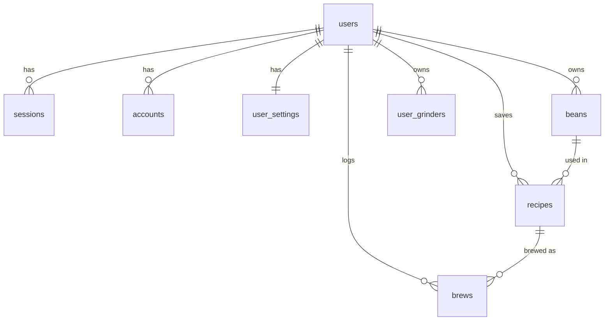

# 07. データベース設計（Cloudflare D1 + Drizzle）

## 1. 方針

- D1（SQLite）。スキーマは `packages/db/src/schema/` に Drizzle で定義し、`drizzle-kit generate` で SQL マイグレーションを生成・コミット
- ID: アプリ生成の **プレフィックス付き nanoid**（`usr_`, `ben_`, `rcp_`, `brw_`）。TEXT PRIMARY KEY
- 日時: `INTEGER`（unix epoch ms）で統一。`created_at` / `updated_at` を全テーブルに
- 論理削除はしない（`deleted_at` なし）。ユーザー削除は CASCADE 物理削除（GDPR的にも単純）
- **器具マスタ（ドリッパー・グラインダー）は DB に置かない** → `packages/engine/src/data/` のコード内データが正。
  理由: バージョン管理・レビュー・型安全がきく。DB には ID 文字列のみ保存（例: `"hario-v60"`）
- エンジン入出力（レシピ本体）は **JSON カラムに Zod スキーマごと保存** + 検索用カラムだけ列に昇格。
  理由: エンジンの進化にマイグレーションが追従しなくて済む。`engine_version` で解釈可能性を担保

## 2. ER 図

## 3. テーブル定義

### 3.1 認証系（Better Auth 標準スキーマ）

`users`, `sessions`, `accounts`, `verifications` — Better Auth の Drizzle adapter が要求する形をそのまま使用。
`users` に追加カラム: `is_anonymous INTEGER`（匿名→本登録昇格フロー用）。

### 3.2 user_settings

| カラム | 型 | 説明 |
|---|---|---|
| user_id | TEXT PK, FK→users CASCADE | |
| default_dripper_id | TEXT | 例 `"hario-v60"`（engine data の ID） |
| default_grinder_id | TEXT | 例 `"delonghi-kg521"` |
| default_taste_profile | TEXT(JSON) | TasteProfile（-2..+2 ×5軸） |
| default_dose_g | REAL | 既定粉量 |
| units | TEXT | `"metric"` 固定（将来 imperial） |
| theme | TEXT | `"system" / "light" / "dark"` |

### 3.3 user_grinders（所有グラインダー + キャリブレーション）

| カラム | 型 | 説明 |
|---|---|---|
| id | TEXT PK | `ugr_` |
| user_id | TEXT FK CASCADE, INDEX | |
| grinder_id | TEXT | engine data の ID |
| calibration_offset | REAL DEFAULT 0 | 目盛補正値（docs/11 §4） |
| calibration_points | TEXT(JSON) | 実測点 `[{setting, micron?}]`（将来の精密補正） |
| is_default | INTEGER | |

### 3.4 beans（豆）

| カラム | 型 | 説明 |
|---|---|---|
| id | TEXT PK | `ben_` |
| user_id | TEXT FK CASCADE, INDEX | |
| name | TEXT NOT NULL | 表示名 |
| roaster | TEXT | ロースター名 |
| origin | TEXT | 産地（自由入力 + サジェスト） |
| variety | TEXT | 品種 |
| process | TEXT NOT NULL | `washed/natural/honey/anaerobic/decaf/other` |
| roast_level | TEXT NOT NULL | `light/medium-light/medium/medium-dark/dark` |
| roast_date | INTEGER | 焙煎日（エイジング計算に使用） |
| notes | TEXT | |
| photo_key | TEXT | R2 オブジェクトキー（β） |
| archived_at | INTEGER | 飲み切りアーカイブ |

### 3.5 recipes（保存レシピ）

| カラム | 型 | 説明 |
|---|---|---|
| id | TEXT PK | `rcp_` |
| user_id | TEXT FK CASCADE, INDEX | |
| bean_id | TEXT FK→beans SET NULL | |
| title | TEXT | 自動生成（「エチオピア × V60」）+ 編集可 |
| input | TEXT(JSON) NOT NULL | BrewInput スナップショット（豆情報も内包） |
| output | TEXT(JSON) NOT NULL | Recipe（手順・根拠つき） |
| engine_version | TEXT NOT NULL | 例 `"1.2.0"` |
| dripper_id | TEXT NOT NULL, INDEX | 検索用昇格カラム |
| is_iced | INTEGER NOT NULL | 〃 |
| visibility | TEXT DEFAULT 'private' | `private/unlisted/public`（共有は v1.0、カラムは最初から） |
| share_id | TEXT UNIQUE | `/r/[shareId]` 用（visibility≠private で発行） |
| source | TEXT DEFAULT 'generated' | `generated/manual/official/competition`（将来の公式レシピ用） |

### 3.6 brews（抽出ログ = 中核テーブル）

| カラム | 型 | 説明 |
|---|---|---|
| id | TEXT PK | `brw_` |
| user_id | TEXT FK CASCADE, INDEX(user_id, brewed_at) | |
| recipe_id | TEXT FK→recipes SET NULL | |
| bean_id | TEXT FK→beans SET NULL | |
| input | TEXT(JSON) NOT NULL | 実際に使った BrewInput（レシピから調整した場合を含む） |
| output | TEXT(JSON) NOT NULL | 実際のレシピ |
| engine_version | TEXT NOT NULL | |
| brewed_at | INTEGER NOT NULL | |
| rating | REAL | 総合 0.5–5.0 |
| taste_feedback | TEXT(JSON) | 感じた5軸（-2..+2）→ フィードバック補正の入力 |
| tds | REAL | 実測 TDS %（任意） |
| actual_time_sec | INTEGER | 実測総抽出時間（目標との乖離分析用） |
| notes | TEXT | |

## 4. マイグレーション運用

1. スキーマ変更 → `pnpm db:generate`（SQL 生成、`packages/db/migrations/` にコミット）
2. ローカル: `pnpm db:migrate:local`（wrangler d1 --local）
3. 本番: デプロイワークフロー内で `wrangler d1 migrations apply DB --remote` を**デプロイ前に**実行（docs/13）
- 破壊的変更（列削除・型変更）は expand → migrate → contract の3段階で行う。1マイグレーションで削除しない
- マイグレーション SQL の手編集は禁止（生成し直す）

## 5. ゲストデータとの同期

- ゲスト: 同スキーマ相当のデータを localStorage（Zodで版管理された envelope）に保存
- サインアップ/イン時: `POST /api/v1/sync/import` にゲストデータを一括送信 → サーバーで ID 再発行して取り込み → ローカルは同期済みフラグ
- コンフリクトは「サーバー優先・ローカルは追記」（同一IDが存在しないため実質単純追記）

## 6. インデックス方針

- 外部キー + 一覧クエリの複合のみ: `brews(user_id, brewed_at DESC)`, `recipes(user_id, created_at DESC)`, `beans(user_id, archived_at)`
- LIKE 検索（豆名）は MVP ではユーザー内データ量が小さいため索引なしで許容

## 7. スケール戦略（数万 MAU 想定）

- 読み取り: D1 read replication（Sessions API）+ ユーザー単位データなのでクエリは常に user_id で絞られ小さい
- 書き込み: 1ユーザーあたり数回/日（brews）で D1 の単一プライマリで十分（5万MAU × 3 brew/日 ≈ 2 write/sec）
- 逃げ道: 集計系（コミュニティ・ランキング）は別テーブル/Queues 非同期化。10GB 上限に近づいたら古い brews の JSON を R2 へアーカイブ
